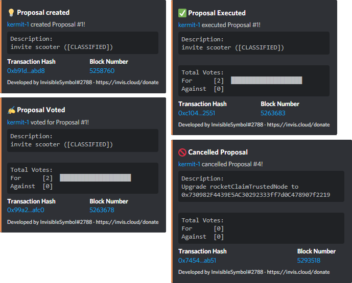
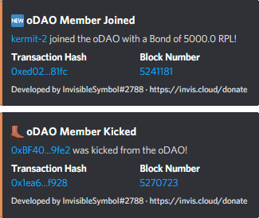
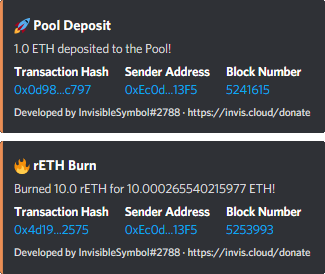

# Rocket Feed
 A Discord bot that tracks Rocket Pool Events
> Note: If anybody from the Rocket Pool Team reads this and plans on hosting an instance themselves, please contact me instead: I would prefer self-hosting it so I can push bug-fixes/updates quicker.

## Features:
- Ability to track Proposals (Description/Vote Count read from Contract):

    

- Ability to track oDAO Member Activity (uses Nicknames of oDAO Members if available):

    

- Ability to track Deposit Poll Activity:

    

- Ability to track Minipool Activity (Provides Link to Validator if feasible):

    

- Supports ENS Addresses:

    

- Automatically retrieves Addresses from Storage Contract at start-up. (Easy support for Upgrades)
- Supports dual-channel setup to separate oDAO Events from the rest.
- Short event-to-message duration (Events are fetched every 15 seconds).
- Deduplication-Logic (prevents duplicated Messages caused by Chain-Reorgs).
- Easy Extendability (Almost no hard-coded Events, most are loaded from a `.json` File)

## Instructions
- Python 3.8 Recommended
- `pip install -r requirements.txt`
- Copy `.env.sample` to `.env` and fill everything out. You can get the channel IDs by enabling Developer Mode in your Discord Settings and Right-Clicking a Channel.
- Run `python main.py`

## How to add new Events:
- Open `./data/rocketpool.json` and add a new Entry to `sources`. Map the Contract Events to new Bot Events.
- Add the required ABI in `./contracts/`. (The Path should look like this: `./contracts/rocketMinipoolManager.abi`). 
- Open `./strings/rocketpool.en.json` and add both `title` and `description` for each new Bot Event. You can access Event Arguments directly using their Names: `%(amount)`. If you want to mention an Address, you can append `_fancy` to get a shorter Version that also automatically links to etherscan.io.

## Donate: 
[<kbd>0x87FF5B8ccFAeEC77b2B4090FD27b11dA2ED808Fb</kbd>](https://invis.cloud/donate)
